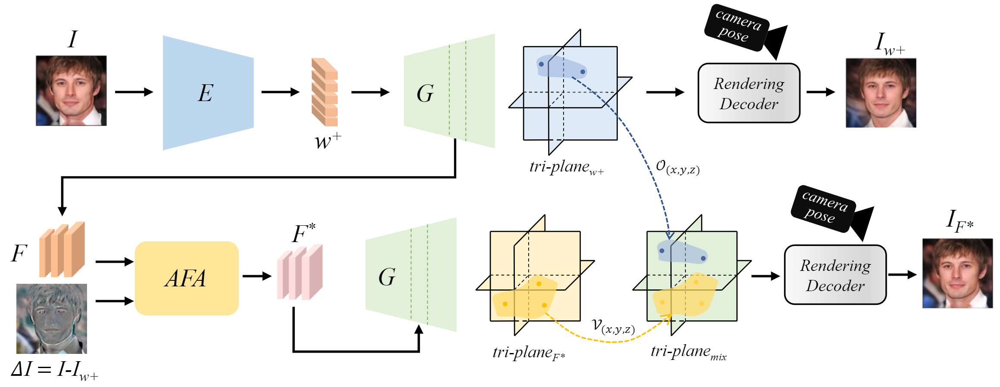

# Make Encoder Great Again in 3D GAN Inversion through Geometry and Occlusion-Aware Encoding (ICCV 2023)


[Paper](https://arxiv.org/abs/2303.12326) | [Project page](https://eg3d-goae.github.io/) | [Demo video](https://www.youtube.com/watch?v=CptQDMqM9Pc)

 Official implementation of "Make Encoder Great Again in 3D GAN Inversion through Geometry and Occlusion-Aware Encoding" ICCV 2023


<video id="video" controls="" preload="none" >
    <source id="mp4" src="assets/teaser.mp4" type="video/mp4">
</video>


## Introduction
We present a encoder-based 3D generative adversarial network (GAN) inversion framework that can efficiently synthesize photo-
realistic novel views while preserving geometry and details of the
input image.
<div align="center">
  
</div>


## :handshake: Citation
If you find this work useful for your research, please cite:
```
@article{yuan2023make,
  title={Make Encoder Great Again in 3D GAN Inversion through Geometry and Occlusion-Aware Encoding},
  author={Yuan, Ziyang and Zhu, Yiming and Li, Yu and Liu, Hongyu and Yuan, Chun},
  journal={arXiv preprint arXiv:2303.12326},
  year={2023}
}
```

